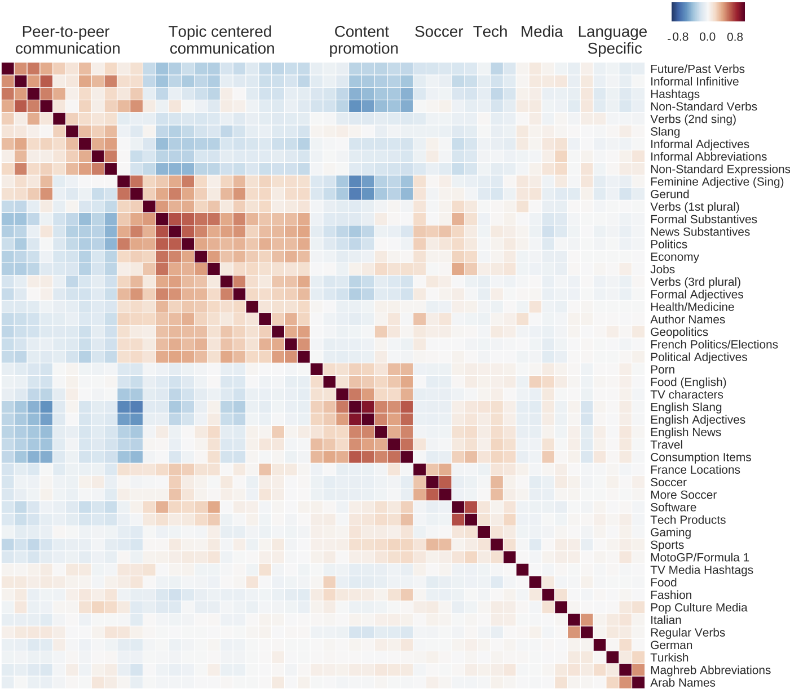
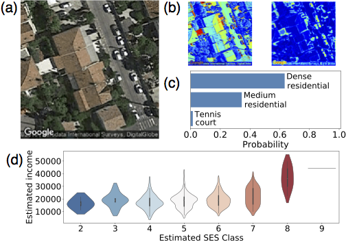

# Optimal Proxy Selection for Socioeconomic Status Inference on Twitter
This repository contains code related to the paper [optimal proxy selection for socioeconomic status inference on Twitter](http://perso.ens-lyon.fr/marton.karsai/). An earlier version of this work was also published in the proceedings of the [ICDM'18](http://lisi.io/iwsc2018/) workshops. 

This repository contains the `Python` codes needed to apply the inference pipeline to similar demographic-enriched twitter data samples.

* code to generate semantics features, reliable home locations and ses-enriched datasets from users tweets and census, is in the [helpers](./python_scripts/certified) folder

  
  

* `Keras` implementations of the `ResNet50` used in this paper to select residential sites are in the [classifier](./python_scripts/certified) folder (with a `TensorFlow` backend)

* code to train and validate the models, for each socioeconomic proxy in the [pipelines](./python_scripts/certified) folder.

### Citation
If you use the code, data, or analysis results in this paper, we kindly ask that you cite the paper above as:

> _Optimal proxy selection for socioeconomic status inference on Twitter_ , J. Levy Abitbol, E. Fleury, M. Karsai, 2019. In Special Issue on Analysis and Applications of Location-Aware Big Complex Network Data, Complexity, Wiley-Hindawi.
